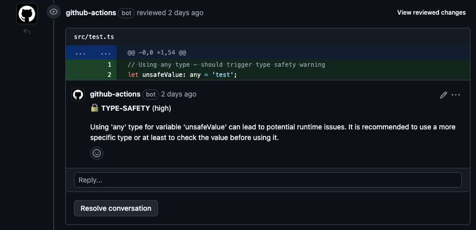
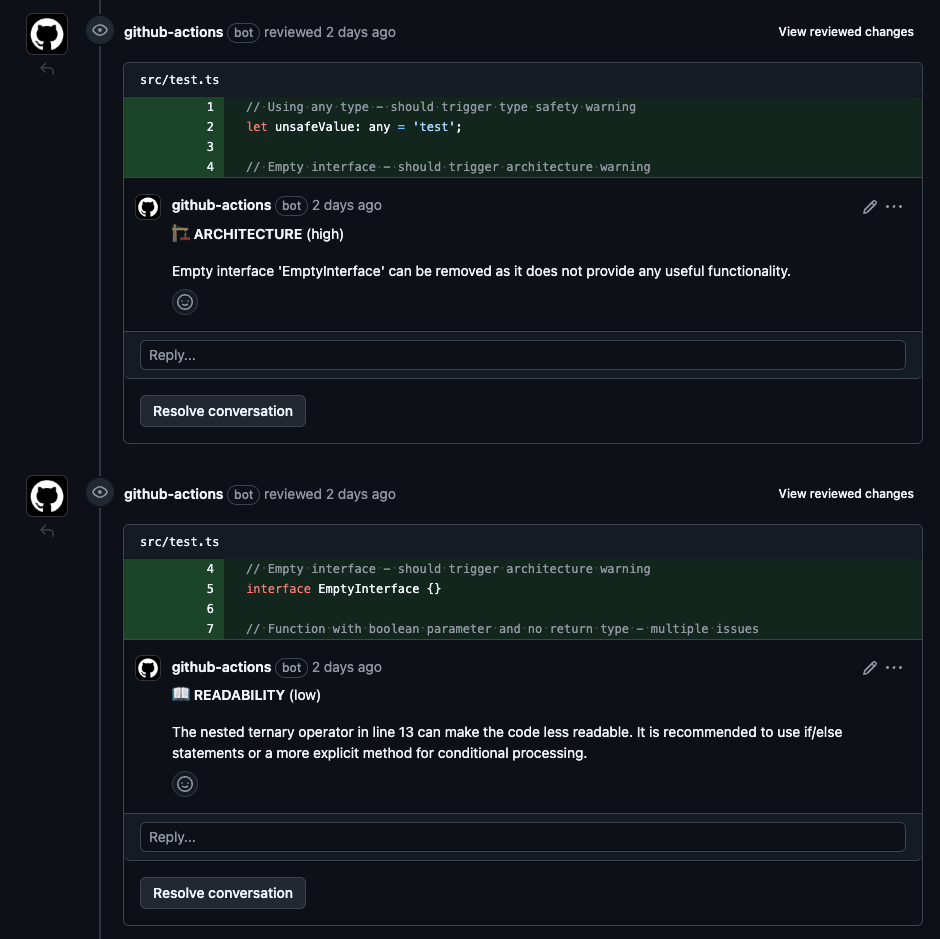

# AI Code Reviewer 🔍

Automate your code reviews with AI-powered insights using Ollama's local models. This GitHub Action provides intelligent code review comments directly in your pull requests, helping catch potential issues and maintain code quality without sending your code to external services.



## Overview

The Ollama Code Review Action analyzes your pull request changes using Ollama's local AI models (default: CodeLlama) and provides contextual feedback directly as PR comments. It runs entirely on your GitHub Actions infrastructure, ensuring your code never leaves your environment.

### Key Features

- 🤖 AI-powered code review using Ollama's local models
- 🔒 Privacy-focused: All processing happens locally within GitHub Actions
- 💡 Intelligent context-aware suggestions
- ⚡ Fast parallel processing of files
- 🎯 Customizable file patterns and review scope
- 📊 Summary statistics for each review session
- 🔄 Deduplication of similar comments
- 🎨 Beautiful, formatted PR comments with severity levels

## Installation

1. Add the following workflow file to your repository (e.g., `.github/workflows/code-review.yml`):

```yaml
name: Code Review

on:
  pull_request:
    types: [opened, synchronize, reopened]

permissions:
  contents: read
  pull-requests: write

jobs:
  review:
    runs-on: ubuntu-latest
    steps:
      - uses: carofi-auto/ollama-code-review@v2
        with:
          github-token: ${{ secrets.GITHUB_TOKEN }}
          file-pattern: "**/*.{ts,tsx}"  # Adjust based on your needs
```

2. The action will automatically start reviewing your pull requests!

## Configuration

### Inputs

| Name | Description | Required | Default |
|------|-------------|----------|---------|
| `github-token` | GitHub token for API access | Yes | N/A |
| `file-pattern` | Glob pattern for files to review | No | `**/*.{ts,tsx}` |
| `model` | Ollama model to use | No | `codellama` |
| `base-branch` | Base branch to compare against | No | `origin/develop` |
| `concurrency-limit` | Number of files to review concurrently | No | `5` |

### Example with Custom Configuration

```yaml
- uses: carofi-auto/ollama-code-review@v2
  with:
    github-token: ${{ secrets.GITHUB_TOKEN }}
    file-pattern: "**/*.{js,jsx,ts,tsx}"
    model: "codellama"
    base-branch: "main"
    concurrency-limit: "3"
```

## How It Works

1. When a pull request is opened or updated, the action:
   - Checks out your repository
   - Installs and starts Ollama locally
   - Identifies changed files in the PR
   - Analyzes the changes using the specified Ollama model
   - Posts review comments directly on the PR

2. The review process includes:
   - Context-aware code analysis
   - Intelligent suggestions for improvements
   - Code quality insights
   - Best practices recommendations



## Contributing

Contributions are welcome! Here's how you can help:

1. Fork the repository
2. Create a feature branch (`git checkout -b feature/amazing-feature`)
3. Commit your changes (`git commit -m 'Add amazing feature'`)
4. Push to the branch (`git push origin feature/amazing-feature`)
5. Open a Pull Request

Please ensure your PR:
- Follows the existing code style
- Includes appropriate tests
- Updates documentation as needed
- Describes the changes in detail

## Development

To set up the project locally:

1. Clone the repository
2. Install dependencies:
   ```bash
   npm install
   ```
3. Make your changes
4. Test locally:
   ```bash
   npm test
   ```

## License

This project is licensed under the MIT License - see the [LICENSE](LICENSE) file for details.

## Acknowledgments

- [Ollama](https://ollama.ai/) for providing the amazing local AI models
- The open-source community for inspiration and support

## Security

This action runs entirely within your GitHub Actions environment. No code is sent to external services. The Ollama model runs locally within the action, ensuring your code stays private.

For security concerns or bug reports, please open an issue or contact the maintainers directly.

## Support

- 📫 For bugs and feature requests, please [open an issue](../../issues/new)
- 💬 For questions and discussions, join our [Discussions](../../discussions)
- 📖 Check out our [Wiki](../../wiki) for additional documentation

---

Made with ❤️ by [Carofi](https://www.carofi.app)
